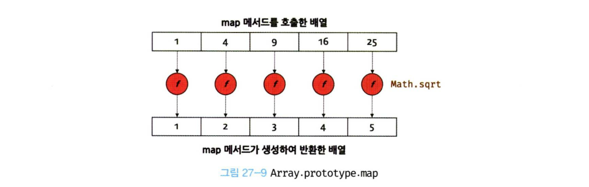

# 렌더링 리스트 및 조건부

### 목표 (Goals)

## Map

### Array.prototype.map
map 메서든느 자신을 호출한 배열의 모든 요소를 순회하면서 인수로 전달받는 콜백 함수를 반복 호출합니다.
그리고 **콜백 함수의 반환값들로 구성된 새로운 배열**을 반홥합니다. 

```javascript
const number = [1, 4, 9]

// map 메서드는 numbers 배열의 모든 요소를 순회하면서 콜백 함수를 반복 호출합니다.
// 그리고 콜백 함수의 반환값들로 구선된 새로운 배열을 반환합니다.
const roots = numbers.map(item => Math.sqrt(item));

//const roots = numbers.map(Math.sqrt);

// map 메서드는 새로운 배열을 반환한다.
console.log(roots); //[ 1, 2, 3]

// map 메서드는 원본 배열을 변경하지 않는다.
console.log(numbers); //[ 1, 4, 9]
```

forEach 메서드와 map 메서드의 공통점은 자신을 호출한 배열의 모든 요소를 순회하면서 인수로 전달 받은 콜백 함수를 반복 호출한다는 것이다.  
하지만 forEach 메서드는 언제나 undefined를 반환하고, map 메서드는 콜백 함수의 반환값들로 구성된 새로운 배열을 반환하는 차이가 있다.
즉 forEach 메서드는 단순히 반복문을 대체하기 위한 고차 함수이고, map 메서든느 요소값을 다른 값으로 매핑한 새로운 배열을 생성하기 위한 고차 함수다.

map 메서드가 생성하여 반환하는 새로운 배열의 length 프로퍼티 값은 map 메서드를 호출한 배열의 length 프로퍼티 값과 반드시 일치한다. 즉 map 메서드를 호출한 배열과 map 메서드가 생성하여 반환한 배ㅕㄹ은 1:1매핑한다.



forEach 메서드와 마찬가지로 map 메서드의 콜백 함수는 map 메서드를 호출한 배열의 요소값과 인덱스, map 메서드를 호출한 배열 자체,
즉 this를 순차적으로 전달받을 수 있다. 다시 말해 map 메서드는 콜백 함수를 호출할 때 3개의 인수, 즉 map 메서드를 호출한 배여르이 요소값과 인덱스 그리고 map 메서드를 호출한 배열을 순차적으로 전달합니다.

```javascript
[1, 2, 3].map((item,index, arr) => {
  console.log(`요소값: ${item}, 인덱스: ${index}, this: ${JSON.stringify(arr)}`);
  return item;
});

/*
요소값: 1, 인덱스: 0, this: [1,2,3]
요소값: 2, 인덱스: 1, this: [1,2,3]
요소값: 3, 인덱스: 2, this: [1,2,3]
* */

```


## Reference
* [리스트와 Key](https://ko.reactjs.org/docs/lists-and-keys.html)
* [Array.prototype.map()](https://developer.mozilla.org/ko/docs/Web/JavaScript/Reference/Global_Objects/Array/map)